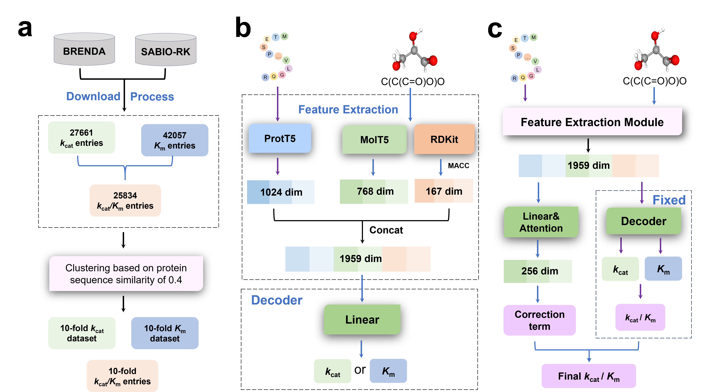

# CataPro

Predicting enzyme kinetic parameters is a crucial task in enzyme discovery and enzyme engineering. Here, we propose a new enzyme kinetic parameter prediction algorithm called CataPro, based on protein language models, small molecule language models, and molecular fingerprints. We collected the latest turnover number (kcat), Michaelis constant (Km), and catalytic efficiency (kcat/Km) data from the BRENDA and SABIO-RK databases. By clustering these data based on 0.4 protein sequence similarity, we obtained the corresponding 10-fold cross-validation datasets. CataPro was trained on these unbiased 10-fold cross-validation datasets, demonstrating superior performance compared to previous predictors in predicting kcat, Km, and kcat/Km.

## Create the CataPro environment
To run CataPro, you should create a conda environment that includes the following packages:

        pytorch >= 1.13.0
        transformers
        numpy
        pandas
        RDKit

In addition, CataPro also relies on additional pre-trained models, including [prot_t5_xl_uniref50](https://huggingface.co/Rostlab/prot_t5_xl_uniref50) and [molt5-base-smiles2caption](https://huggingface.co/laituan245/molt5-base-smiles2caption). These two models are used for extracting features from enzymes and substrates, respectively. You need to place the weights for these two pre-trained models in the `models` directory.

## Contact
Zechen Wang, PhD, Shandong University, wangzch97@gmail.com

## Usage
### 1. Prepare the input files for inference
Enzyme and substrate information should be organized in a DataFrame created with pandas (in CSV format). Each enzyme-substrate pair must include the Enzyme_id, type (wild-type or mutant), the enzyme sequence, and the substrate's SMILES. The format is as follows:

|   Enzyme_id   |   type    |   sequence    |   smiles  |
|---------------|-----------|---------------|-----------|
|   Q6WZB0  |   wild    |   MTESPTTHHGAAPPDSV...    |   C(CC(C(=O)O)N)CN=C(N)N  |
|   B2MWN0  |   wild    |   MSSCQWSSFTRVSLSPF...    |   C(C(C(=O)O)N)S  |
|   C5AQP6  |   wild    |   MVLTRFPRVALTDGPTP...    |   C(C(C(=O)O)N)S  |

You can also refer to a sample file samples/sample_inp.csv

### 2. Next, you can use the following command to run CataPro to infer the kinetic parameters of the enzymatic reaction:

        python predict.py \
                -inp_fpath samples/sample_inp.csv \
                -model_dpath models \
                -batch_size 64 \
                -device cuda:0 \
                -out_fpath catapro_prediction.csv

Finally, the prediction results from CataPro are stored in the "catapro_prediction.csv" file. You can also run "bash run_catapro.sh" directly in the inference directory to achieve the above process.

## Question and Answer
To be updated ...
